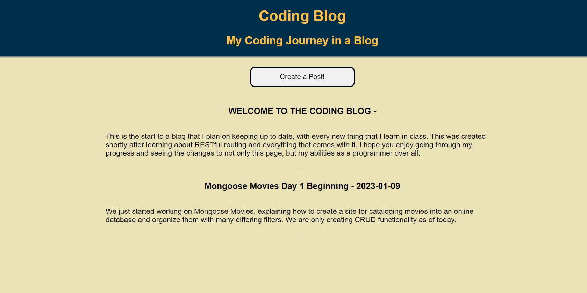
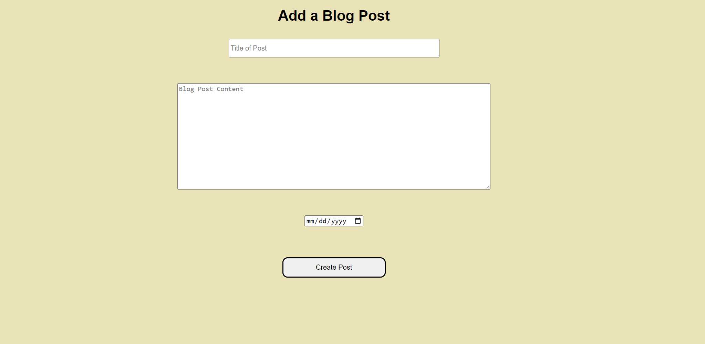

# CODING JOURNEY BLOG POST

This Blog was create with two purposes in mind.
1. I wanted practice with RESTful routing
2. I wanted a place to keep track of my journey as a programmer

This seemed like a great opportunity to tackle both of those things. As I progress as I programmer, I plan on adding entries to the blog to track my growth. Not only that, but I also plan on making updates to the blog as I learn new things, making it as hip as I can, in terms of what keeping it updated to reflect the latest things that I have learned, if it works well with a blog.

## Features
---

## Technologies Used
- JavaScript
- MongoDB
- Mongoose
- EJS
- REST routes
- CSS stylings